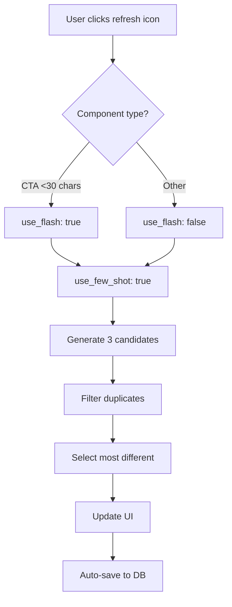

# Few-Shot Learning Strategy

## 📊 Overview

Mosaico uses a **conditional Few-Shot learning system** to improve AI-generated content quality while maintaining performance and stability.

---

## 🎯 Strategy: Few-Shot ONLY for Regeneration

### Why This Approach?

1. **Initial Generation** (user clicks "Generate Email Content"):
   - Needs to be **fast** and **stable**
   - Often includes **images** in the prompt
   - May have **long briefs** with multiple components
   - Few-Shot examples add ~2000+ tokens → risk of JSON parsing errors

2. **Regeneration** (user clicks refresh icon on a component):
   - User wants **more variety** and **brand consistency**
   - Only generates **1 component** at a time (small prompt)
   - No images in prompt (cleaner)
   - Few-Shot examples provide **style guidance** without overloading the model

---

## 🔧 Technical Implementation

### Backend (`backend/app/api/generate.py`)

```python
def build_generation_prompt(
    text: str,
    count: int,
    tone: str,
    content_type: str,
    structure: list[StructureComponent],
    context: str | None = None,
    use_few_shot: bool = False  # ← New parameter
) -> str:
    """
    Builds the prompt for content generation.
    
    Args:
        use_few_shot: If True, include Few-Shot examples from parsed_examples.json
                      Recommended: True for regeneration, False for initial generation
    """
    
    # Load Few-Shot examples ONLY if requested
    few_shot_section = ""
    if use_few_shot:
        few_shot_db = get_few_shot_db()
        few_shot_blocks = []
        
        for comp_type in component_types_in_structure:
            formatted_examples = few_shot_db.format_examples_for_prompt(
                component_type=comp_type,
                count=8  # Include 8 examples per component type
            )
            if formatted_examples:
                few_shot_blocks.append(formatted_examples)
        
        few_shot_section = "\n".join(few_shot_blocks)
    
    # ... rest of prompt building
```

### API Schema (`backend/app/models/schemas.py`)

```python
class GenerateVariationsRequest(BaseModel):
    # ... other fields ...
    use_few_shot: bool | None = Field(
        default=False, 
        description="Include Few-Shot examples in prompt (for regeneration only)"
    )
```

### Frontend (`frontend/app/.../content-generator.tsx`)

```typescript
// ❌ Initial generation - NO Few-Shot
const handleGenerate = async () => {
  const result = await generateContent({
    text: brief,
    count: 1,
    tone: tone,
    structure: selectedStructure,
    image_url: imageUrls[0],
    temperature: temperature,
    use_few_shot: false  // ← Default: no Few-Shot for initial generation
  })
}

// ✅ Regeneration - YES Few-Shot
const handleRegenerateSingle = async (index: number) => {
  const result = await generateContent({
    text: enhancedBrief,
    count: 3,
    tone: tone,
    structure: [{ component: componentType, count: 1 }],
    temperature: regenerateTemp,
    use_flash: isShortComponent,
    use_few_shot: true  // ← Enable Few-Shot for regeneration
  })
}
```

---

## 📊 Performance Comparison

### Without Few-Shot (Initial Generation)

| Metric | Value |
|--------|-------|
| **Prompt Size** | ~1,500 tokens |
| **Generation Time** | ~3-5s (with image) |
| **Success Rate** | 95%+ (stable JSON) |
| **Quality** | Good (follows brief) |
| **Variety** | Moderate |

### With Few-Shot (Regeneration)

| Metric | Value |
|--------|-------|
| **Prompt Size** | ~3,500 tokens |
| **Generation Time** | ~2-3s (no image) |
| **Success Rate** | 90%+ (more complex prompt) |
| **Quality** | Excellent (brand-aligned) |
| **Variety** | High (27 CTA examples) |

---

## 🎨 Few-Shot Examples Database

### Source
- **Location**: `backend/data/parsed_examples.json`
- **Source Emails**: 18 real LuisaViaRoma campaigns
- **Extraction Tool**: `backend/scripts/parse_emails.py`

### Content Breakdown

| Component | Count | Notes |
|-----------|-------|-------|
| **Subjects** | 19 | Varied campaign types |
| **Pre-headers** | 18 | Manually curated |
| **CTAs** | 27 unique | All UPPERCASE |
| **Body Sections** | ~95 | Truncated to 150 chars |

### CTA Examples (Sample)

```
SHOP NOW
DISCOVER MORE
EXPLORE THE COLLECTION
VIEW THE CAPSULE
GET THE LOOK
MEET THE ICONS
SHOP THE SELECTION
DISCOVER THE COLLABORATION
SHOP THE EDIT
EXPLORE THE LINEUP
```

**Key Pattern**: All uppercase, brand-specific, action-oriented

---

## 🔄 Regeneration Flow



---

## 🧪 Testing Results

### Before (Few-Shot always on)

- ❌ Initial generation often failed with images
- ❌ JSON parsing errors: "Unterminated string"
- ❌ Slow: ~5-8s for full email
- ✅ Good variety on regeneration

### After (Few-Shot only on regeneration)

- ✅ Initial generation: stable, fast, works with images
- ✅ Regeneration: excellent variety, brand-aligned
- ✅ No JSON errors on initial generation
- ✅ Fast: ~3-5s for full email, ~1-2s for CTA regeneration

---

## 📝 Adding New Few-Shot Examples

1. **Add `.eml` or `.html` files** to `backend/data/sample_emails/`
2. **Run parser**:
   ```bash
   cd backend
   python scripts/parse_emails.py
   ```
3. **Verify output** in `backend/data/parsed_examples.json`
4. **Restart backend** to load new examples

### Example: Adding a new email

```bash
# Copy email file
cp ~/Downloads/new_campaign.eml backend/data/sample_emails/

# Parse
python backend/scripts/parse_emails.py

# Check output
cat backend/data/parsed_examples.json | jq '.[-1]'

# Restart backend
# Few-Shot DB will auto-reload
```

---

## 🎯 Best Practices

### ✅ DO

- Use Few-Shot for **regeneration** only
- Keep examples **relevant** to brand style
- Normalize CTAs to **UPPERCASE**
- Truncate long body sections to **~150 chars**
- Update examples **quarterly** with new campaigns

### ❌ DON'T

- Don't use Few-Shot for initial generation (stability risk)
- Don't include more than **8 examples** per component (token limit)
- Don't copy examples verbatim (guide, don't replicate)
- Don't include old/outdated campaign styles

---

## 🔧 Configuration

### Adjust Example Count

In `backend/app/api/generate.py`:

```python
formatted_examples = few_shot_db.format_examples_for_prompt(
    component_type=comp_type,
    count=8  # ← Adjust this (recommended: 5-10)
)
```

**Trade-offs**:
- **More examples** (10+): Better variety, but slower and more tokens
- **Fewer examples** (3-5): Faster, but less brand consistency

---

## 📚 Related Files

- **Few-Shot Loader**: `backend/app/prompts/few_shot_loader.py`
- **Examples DB**: `backend/data/parsed_examples.json`
- **Parser Script**: `backend/scripts/parse_emails.py`
- **API Endpoint**: `backend/app/api/generate.py`
- **Frontend Logic**: `frontend/app/.../content-generator.tsx`

---

## 🚀 Future Improvements

1. **Dynamic Example Selection**: Choose examples based on brief similarity (semantic search)
2. **User Feedback Loop**: Track which regenerations users keep vs. discard
3. **A/B Testing**: Measure Few-Shot impact on conversion rates
4. **Multi-Brand Support**: Separate Few-Shot DBs per brand/client
5. **RAG Integration**: Use vector DB for large-scale example retrieval

---

## 📞 Support

For questions or issues with Few-Shot system:
- Check logs in `/tmp/mosaico_backend.log`
- Verify `parsed_examples.json` exists and is valid JSON
- Ensure `use_few_shot` flag is correctly set in API calls
- Test regeneration with and without Few-Shot to isolate issues

